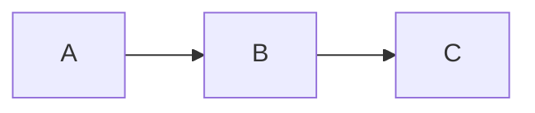
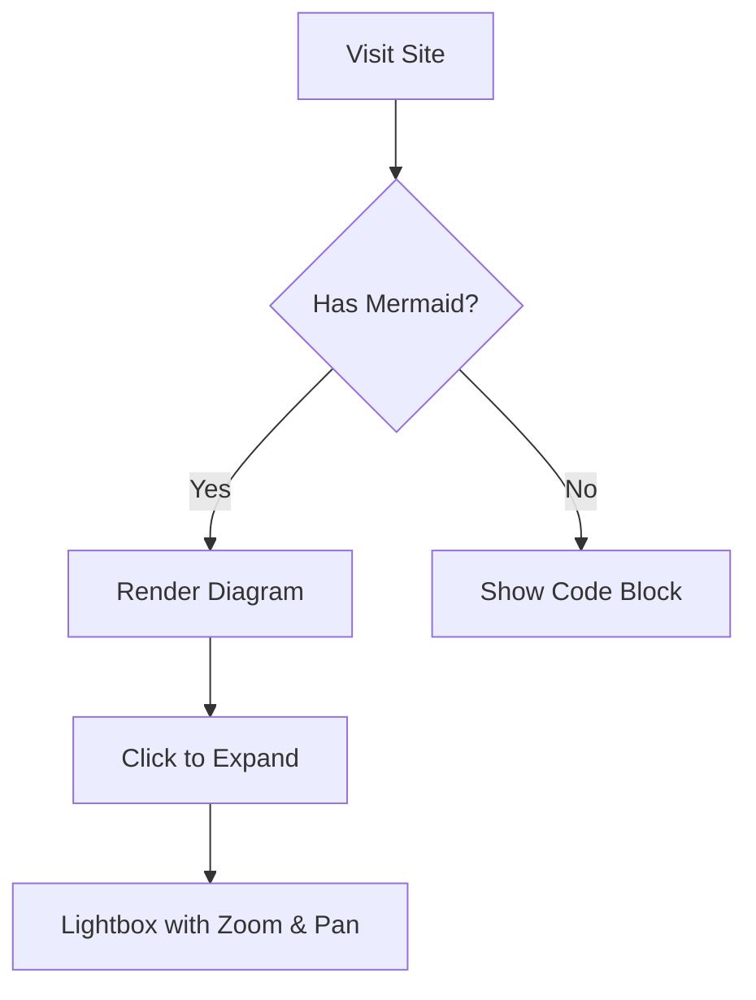

# docsify-mermaid-simple

A lightweight Docsify 5 plugin that adds **Mermaid** diagram rendering with a single `<script>` import.  
No extra CSS or dependency tags needed — the plugin self-injects everything.

## Features

- Single `<script>` tag — auto-loads Mermaid from CDN, injects CSS
- Neutral theme by default (configurable)
- Lightbox with **zoom**, **pan**, and **keyboard navigation**
- Previous / Next diagram navigation inside the lightbox
- Scroll-wheel zoom, drag to pan, touch support
- Works with GitHub Pages out of the box

## Quick start

```html
<script src="docsify-mermaid-lightbox.js"></script>
```

That's it. Drop the script **before** the Docsify script in your `index.html`.

## Configuration

Optional — set `window.$docsifyMermaid` before the plugin loads:

```js
window.$docsifyMermaid = {
  theme: 'neutral',   // 'default', 'dark', 'forest', 'neutral'
  darkMode: false,
  lightbox: true,      // set false to disable the lightbox
};
```

## Writing diagrams

Use fenced code blocks with the language `mermaid`:

````markdown

````

## Lightbox controls

| Action | Mouse / Touch | Keyboard |
|--------|--------------|----------|
| Open | Click diagram | — |
| Close | Click backdrop / ✕ | `Esc` |
| Zoom in | Scroll up / `+` button | `+` |
| Zoom out | Scroll down / `−` button | `-` |
| Reset view | `↺` button | `0` |
| Previous | `❮` button | `←` |
| Next | `❯` button | `→` |
| Pan | Drag | — |

## Test pages

- [Examples](examples.md) — common diagram types
- [Stress Test](stress-test.md) — **all 21 Mermaid diagram types** in one page

## Demo diagram



## License

MIT
