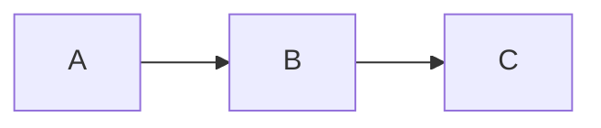
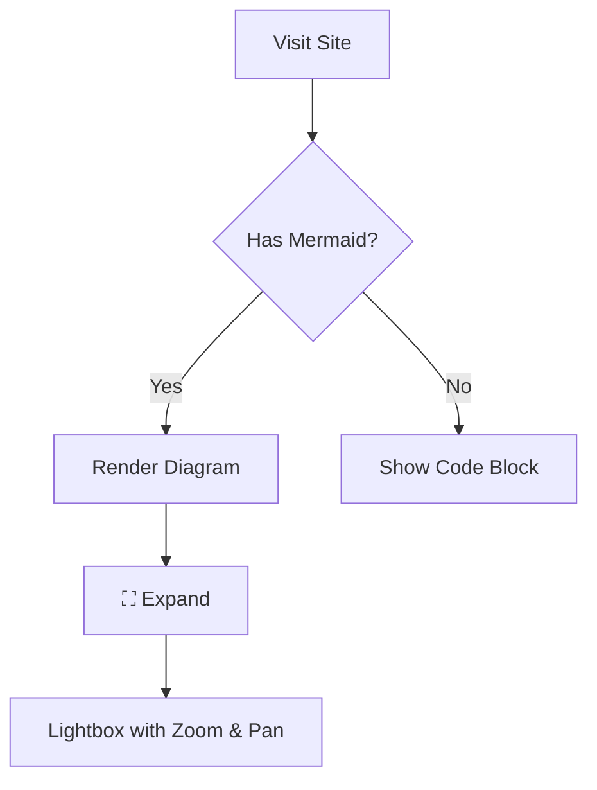

# docsify-mermaid-lightbox

<p align="center">
  
</p>

A lightweight, self-contained [Docsify 5](https://docsify.js.org) plugin for **Mermaid** diagram rendering with a full-featured **lightbox**.  
Single `<script>` import — no extra CSS or dependency tags needed.

## Features

- **Single `<script>` tag** — auto-loads Mermaid from CDN, injects all CSS
- **Auto dark / light mode** — detects Docsify 5 theme or OS preference, picks matching Mermaid theme
- **Lightbox** with fit-to-screen zoom, pan, and keyboard navigation
- **Wide zoom range** — 0.1× to 20×, with adaptive scroll speed
- **Text selection & interactivity** preserved in both inline diagrams and lightbox
- **Copy to clipboard** — button on each inline diagram and inside the lightbox toolbar
- Pinch-to-zoom and swipe navigation on touch devices
- Previous / Next diagram navigation inside the lightbox
- Works with GitHub Pages out of the box

## Quick start

```html
<script src="https://gllmar.github.io/docsify-mermaid-lightbox/docsify-mermaid-lightbox.js"></script>
```

That's it. Drop the script **before** the Docsify script in your `index.html`.

## Configuration

Optional — set `window.$docsifyMermaid` before the plugin loads:

```js
window.$docsifyMermaid = {
  theme: 'auto',       // 'auto' (default), 'neutral', 'default', 'dark', 'forest'
  lightbox: true,      // set false to disable the lightbox
};
```

| Option | Default | Description |
|--------|---------|-------------|
| `theme` | `'auto'` | Mermaid theme. `'auto'` picks `dark` or `neutral` based on OS / Docsify 5 theme |
| `mermaidUrl` | jsDelivr latest | Custom URL for the Mermaid ESM module |
| `lightbox` | `true` | Enable / disable the expand button and lightbox |

## Writing diagrams

Use fenced code blocks with the language `mermaid`:

````markdown

````

## Lightbox controls

| Action | Mouse / Touch | Keyboard |
|--------|--------------|----------|
| Open | ⛶ expand button (top-right) | — |
| Close | Click backdrop / ✕ | `Esc` |
| Zoom in | Scroll up / pinch out / `+` button | `+` |
| Zoom out | Scroll down / pinch in / `−` button | `-` |
| Reset (fit) | `↺` button / double-tap | `0` |
| Previous | `❮` button / swipe right | `←` |
| Next | `❯` button / swipe left | `→` |
| Pan | Drag (after 5 px threshold) | — |
| Select text | Click / drag on text | — |
| Copy source | `⎘` button (inline or lightbox toolbar) | — |

## Test pages

- [Examples](examples.md) — common diagram types
- [Stress Test](stress-test.md) — all 21 Mermaid diagram types in one page
- [Mermaid Reference](mermaid-reference.md) — comprehensive syntax guide for every diagram type

## Demo diagram



## License

MIT
