# Mermaid Stress Test

Every supported Mermaid diagram type in one page. Click any diagram to open the lightbox.

---

## 1. Flowchart (TD)

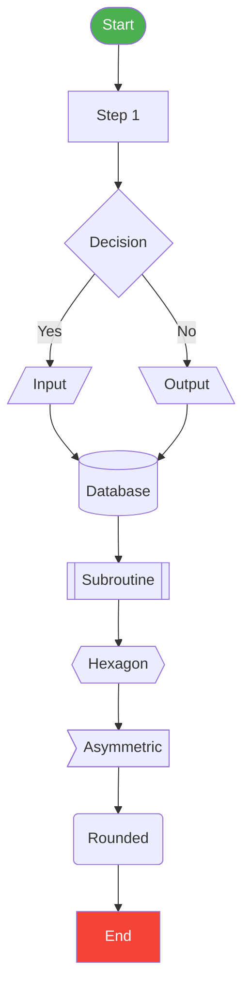
```mermaid
graph TD
    A([Start]) --> B[Step 1]
    B --> C{Decision}
    C -->|Yes| D[/Input/]
    C -->|No| E[\Output\]
    D --> F[(Database)]
    E --> F
    F --> G[[Subroutine]]
    G --> H{{Hexagon}}
    H --> I>Asymmetric]
    I --> J(Rounded)
    J --> K[End]
    style A fill:#4CAF50,color:#fff
    style K fill:#f44336,color:#fff
```

## 2. Flowchart (LR)

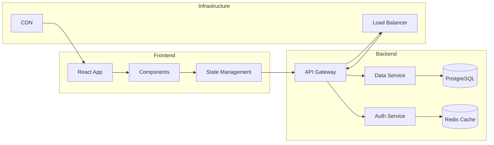
```mermaid
graph LR
    subgraph Frontend
        A[React App] --> B[Components]
        B --> C[State Management]
    end
    subgraph Backend
        D[API Gateway] --> E[Auth Service]
        D --> F[Data Service]
        F --> G[(PostgreSQL)]
        E --> H[(Redis Cache)]
    end
    subgraph Infrastructure
        I[CDN] --> A
        D --> J[Load Balancer]
    end
    C --> D
    J --> D
```

## 3. Sequence Diagram

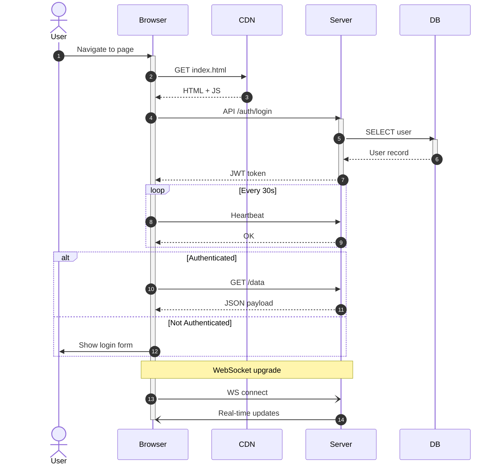
```mermaid
sequenceDiagram
    autonumber
    actor User
    participant Browser
    participant CDN
    participant Server
    participant DB

    User->>Browser: Navigate to page
    activate Browser
    Browser->>CDN: GET index.html
    CDN-->>Browser: HTML + JS
    Browser->>Server: API /auth/login
    activate Server
    Server->>DB: SELECT user
    activate DB
    DB-->>Server: User record
    deactivate DB
    Server-->>Browser: JWT token
    deactivate Server

    loop Every 30s
        Browser->>Server: Heartbeat
        Server-->>Browser: OK
    end

    alt Authenticated
        Browser->>Server: GET /data
        Server-->>Browser: JSON payload
    else Not Authenticated
        Browser->>User: Show login form
    end

    Note over Browser,Server: WebSocket upgrade
    Browser-)Server: WS connect
    Server-)Browser: Real-time updates
    deactivate Browser
```

## 4. Class Diagram

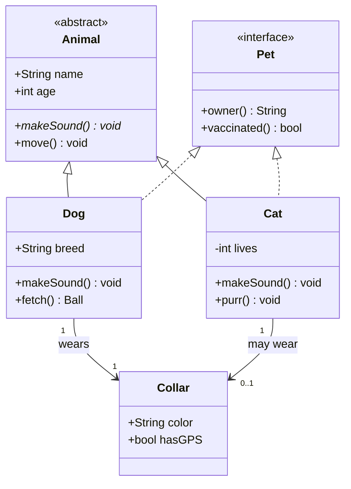
```mermaid
classDiagram
    class Animal {
        <<abstract>>
        +String name
        +int age
        +makeSound()* void
        +move() void
    }
    class Dog {
        +String breed
        +makeSound() void
        +fetch() Ball
    }
    class Cat {
        -int lives
        +makeSound() void
        +purr() void
    }
    class Pet {
        <<interface>>
        +owner() String
        +vaccinated() bool
    }
    class Collar {
        +String color
        +bool hasGPS
    }

    Animal <|-- Dog
    Animal <|-- Cat
    Pet <|.. Dog
    Pet <|.. Cat
    Dog "1" --> "1" Collar : wears
    Cat "1" --> "0..1" Collar : may wear
```

## 5. State Diagram

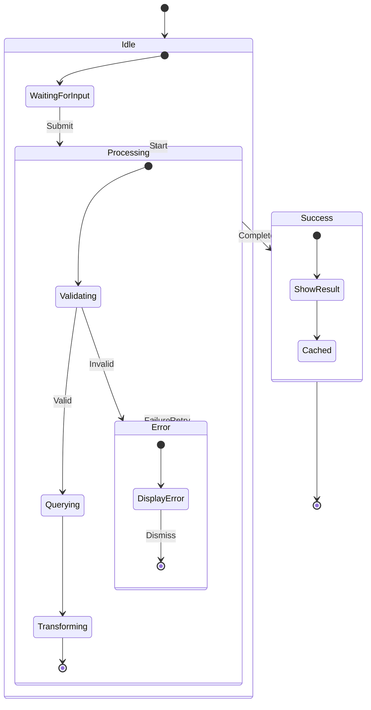
```mermaid
stateDiagram-v2
    [*] --> Idle

    state Idle {
        [*] --> WaitingForInput
        WaitingForInput --> Processing: Submit
    }

    state Processing {
        [*] --> Validating
        Validating --> Querying: Valid
        Validating --> Error: Invalid
        Querying --> Transforming
        Transforming --> [*]
    }

    state Error {
        [*] --> DisplayError
        DisplayError --> [*]: Dismiss
    }

    Idle --> Processing: Start
    Processing --> Success: Complete
    Processing --> Error: Failure
    Error --> Idle: Retry
    Success --> [*]

    state Success {
        [*] --> ShowResult
        ShowResult --> Cached
    }
```

## 6. Entity Relationship Diagram

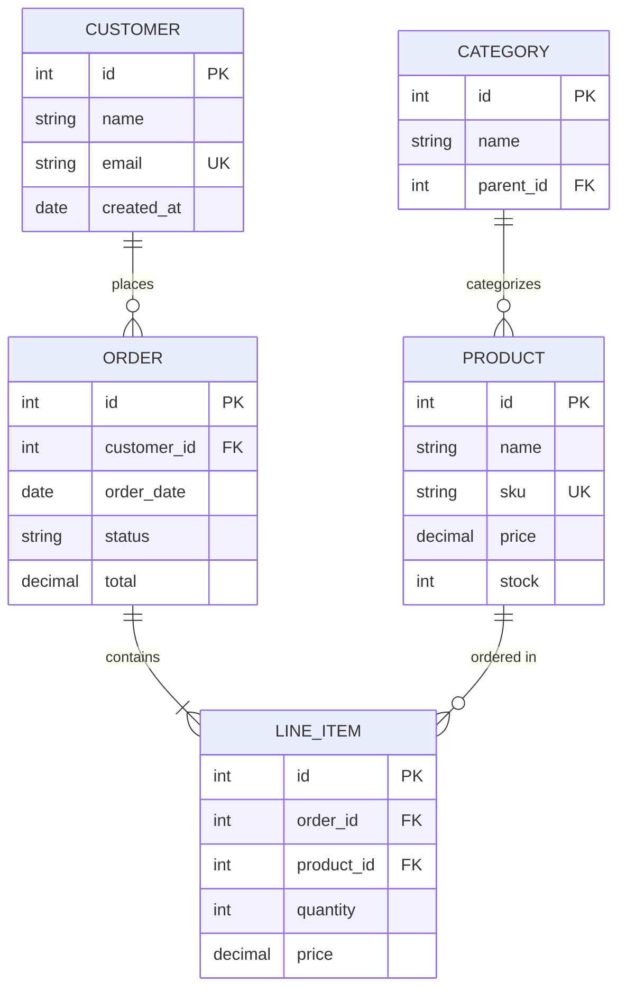
```mermaid
erDiagram
    CUSTOMER ||--o{ ORDER : places
    CUSTOMER {
        int id PK
        string name
        string email UK
        date created_at
    }
    ORDER ||--|{ LINE_ITEM : contains
    ORDER {
        int id PK
        int customer_id FK
        date order_date
        string status
        decimal total
    }
    LINE_ITEM {
        int id PK
        int order_id FK
        int product_id FK
        int quantity
        decimal price
    }
    PRODUCT ||--o{ LINE_ITEM : "ordered in"
    PRODUCT {
        int id PK
        string name
        string sku UK
        decimal price
        int stock
    }
    CATEGORY ||--o{ PRODUCT : categorizes
    CATEGORY {
        int id PK
        string name
        int parent_id FK
    }
```

## 7. Gantt Chart

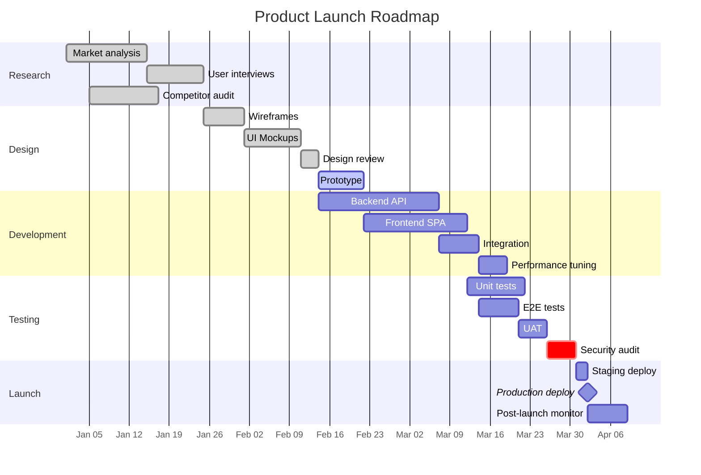
```mermaid
gantt
    title Product Launch Roadmap
    dateFormat YYYY-MM-DD
    axisFormat %b %d

    section Research
        Market analysis       :done,    r1, 2025-01-01, 14d
        User interviews       :done,    r2, after r1, 10d
        Competitor audit       :done,    r3, 2025-01-05, 12d

    section Design
        Wireframes            :done,    d1, after r2, 7d
        UI Mockups            :done,    d2, after d1, 10d
        Design review         :done,    d3, after d2, 3d
        Prototype             :active,  d4, after d3, 8d

    section Development
        Backend API           :         dev1, after d3, 21d
        Frontend SPA          :         dev2, after d4, 18d
        Integration           :         dev3, after dev1, 7d
        Performance tuning    :         dev4, after dev3, 5d

    section Testing
        Unit tests            :         t1, after dev2, 10d
        E2E tests             :         t2, after dev3, 7d
        UAT                   :         t3, after t2, 5d
        Security audit        :crit,    t4, after t3, 5d

    section Launch
        Staging deploy        :         l1, after t4, 2d
        Production deploy     :milestone, l2, after l1, 0d
        Post-launch monitor   :         l3, after l2, 7d
```

## 8. Pie Chart

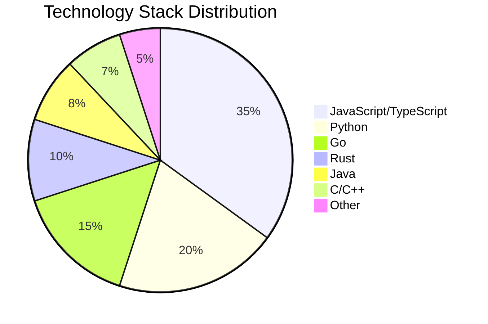
```mermaid
pie title Technology Stack Distribution
    "JavaScript/TypeScript" : 35
    "Python" : 20
    "Go" : 15
    "Rust" : 10
    "Java" : 8
    "C/C++" : 7
    "Other" : 5
```

## 9. Git Graph

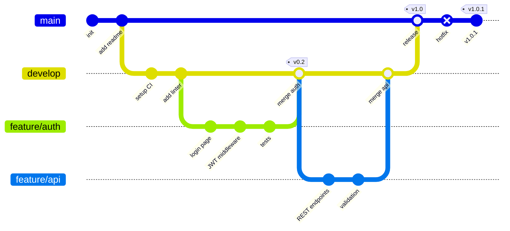
```mermaid
gitGraph
    commit id: "init"
    commit id: "add readme"
    branch develop
    checkout develop
    commit id: "setup CI"
    commit id: "add linter"
    branch feature/auth
    checkout feature/auth
    commit id: "login page"
    commit id: "JWT middleware"
    commit id: "tests"
    checkout develop
    merge feature/auth id: "merge auth" tag: "v0.2"
    branch feature/api
    checkout feature/api
    commit id: "REST endpoints"
    commit id: "validation"
    checkout develop
    merge feature/api id: "merge api"
    checkout main
    merge develop id: "release" tag: "v1.0"
    commit id: "hotfix" type: REVERSE
    commit id: "v1.0.1" tag: "v1.0.1"
```

## 10. User Journey

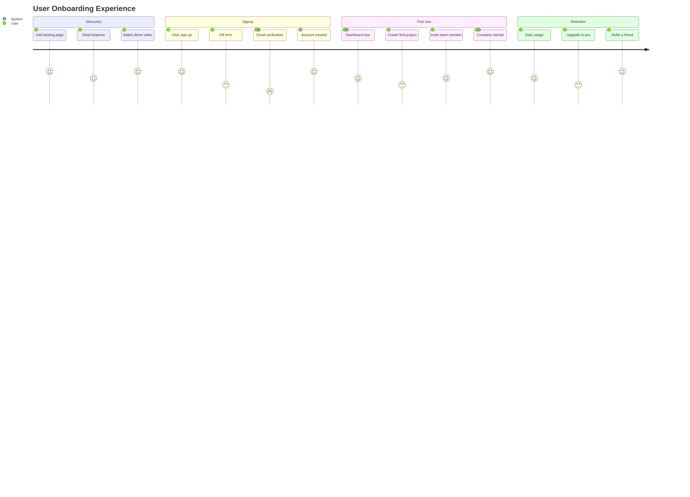
```mermaid
journey
    title User Onboarding Experience
    section Discovery
        Visit landing page: 5: User
        Read features: 4: User
        Watch demo video: 5: User
    section Signup
        Click sign up: 5: User
        Fill form: 3: User
        Email verification: 2: User, System
        Account created: 5: System
    section First Use
        Dashboard tour: 4: User, System
        Create first project: 3: User
        Invite team member: 4: User
        Complete tutorial: 5: User, System
    section Retention
        Daily usage: 4: User
        Upgrade to pro: 3: User
        Refer a friend: 5: User
```

## 11. Quadrant Chart

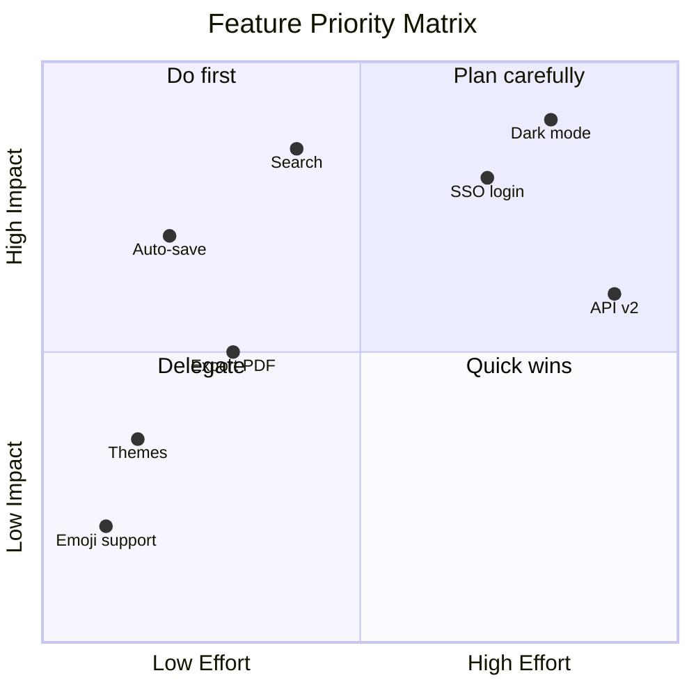
```mermaid
quadrantChart
    title Feature Priority Matrix
    x-axis Low Effort --> High Effort
    y-axis Low Impact --> High Impact
    quadrant-1 Plan carefully
    quadrant-2 Do first
    quadrant-3 Delegate
    quadrant-4 Quick wins
    Dark mode: [0.8, 0.9]
    Auto-save: [0.2, 0.7]
    SSO login: [0.7, 0.8]
    Export PDF: [0.3, 0.5]
    Emoji support: [0.1, 0.2]
    API v2: [0.9, 0.6]
    Search: [0.4, 0.85]
    Themes: [0.15, 0.35]
```

## 12. Requirement Diagram

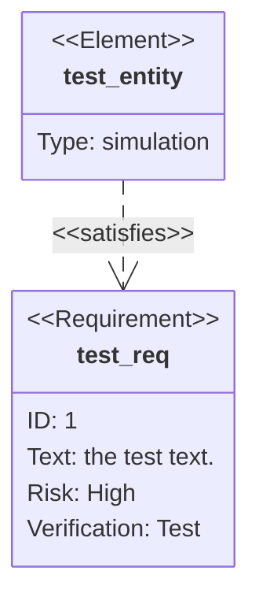
```mermaid
requirementDiagram

    requirement test_req {
    id: 1
    text: the test text.
    risk: high
    verifymethod: test
    }

    element test_entity {
    type: simulation
    }

    test_entity - satisfies -> test_req
```

## 13. Mindmap

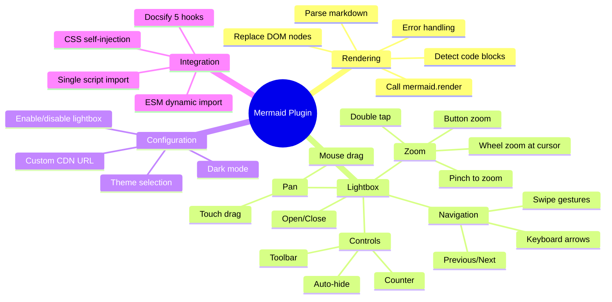
```mermaid
mindmap
    root((Mermaid Plugin))
        Rendering
            Parse markdown
            Detect code blocks
            Call mermaid.render
            Replace DOM nodes
            Error handling
        Lightbox
            Open/Close
            Zoom
                Wheel zoom at cursor
                Pinch to zoom
                Double tap
                Button zoom
            Pan
                Mouse drag
                Touch drag
            Navigation
                Previous/Next
                Keyboard arrows
                Swipe gestures
            Controls
                Auto-hide
                Toolbar
                Counter
        Configuration
            Theme selection
            Dark mode
            Custom CDN URL
            Enable/disable lightbox
        Integration
            Docsify 5 hooks
            Single script import
            CSS self-injection
            ESM dynamic import
```

## 14. Timeline

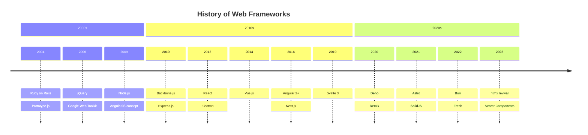
```mermaid
timeline
    title History of Web Frameworks
    section 2000s
        2004 : Ruby on Rails
             : Prototype.js
        2006 : jQuery
             : Google Web Toolkit
        2009 : Node.js
             : AngularJS concept
    section 2010s
        2010 : Backbone.js
             : Express.js
        2013 : React
             : Electron
        2014 : Vue.js
        2016 : Angular 2+
             : Next.js
        2019 : Svelte 3
    section 2020s
        2020 : Deno
             : Remix
        2021 : Astro
             : SolidJS
        2022 : Bun
             : Fresh
        2023 : htmx revival
             : Server Components
```

## 15. Sankey Diagram

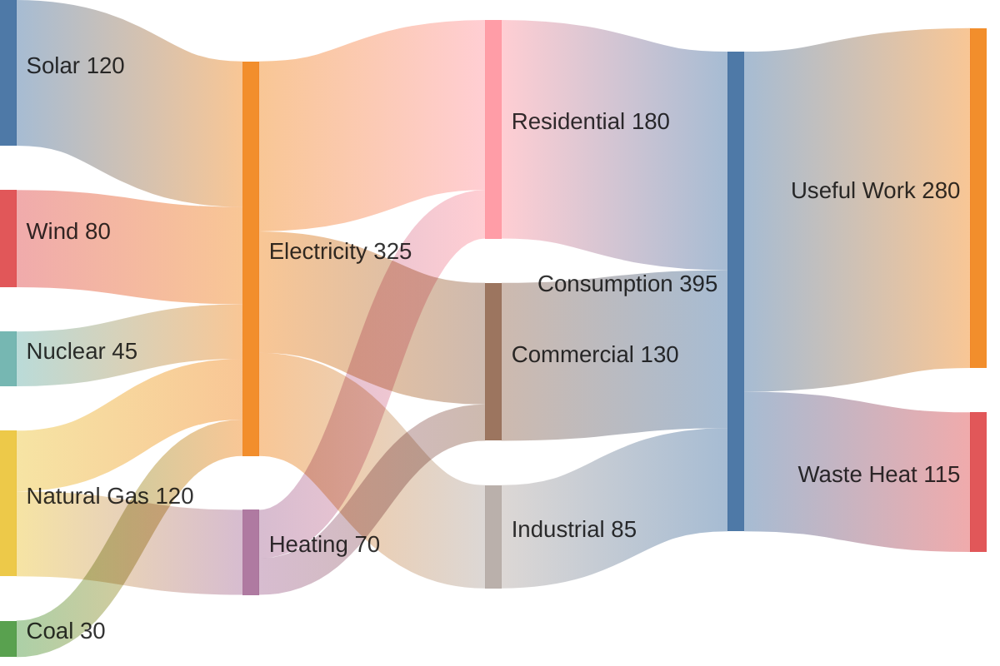
```mermaid
sankey-beta

%% Energy flow
Solar,Electricity,120
Wind,Electricity,80
Nuclear,Electricity,45
Coal,Electricity,30
Natural Gas,Electricity,50
Natural Gas,Heating,70
Electricity,Residential,140
Electricity,Commercial,100
Electricity,Industrial,85
Heating,Residential,40
Heating,Commercial,30
Residential,Consumption,180
Commercial,Consumption,130
Industrial,Consumption,85
Consumption,Useful Work,280
Consumption,Waste Heat,115
```

## 16. XY Chart

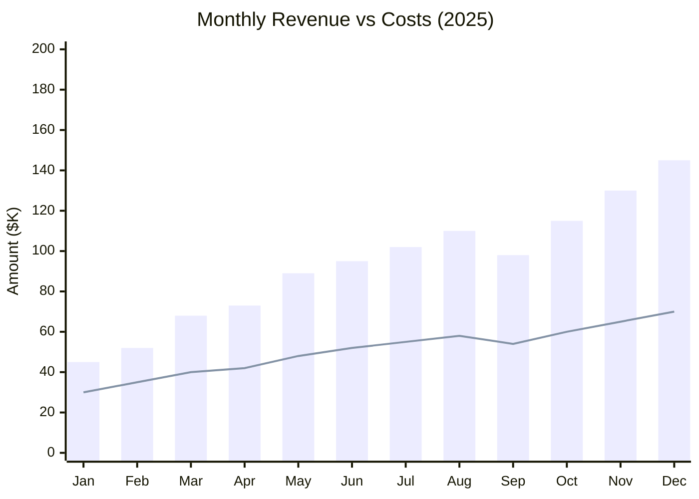
```mermaid
xychart-beta
    title "Monthly Revenue vs Costs (2025)"
    x-axis [Jan, Feb, Mar, Apr, May, Jun, Jul, Aug, Sep, Oct, Nov, Dec]
    y-axis "Amount ($K)" 0 --> 200
    bar [45, 52, 68, 73, 89, 95, 102, 110, 98, 115, 130, 145]
    line [30, 35, 40, 42, 48, 52, 55, 58, 54, 60, 65, 70]
```

## 17. Block Diagram

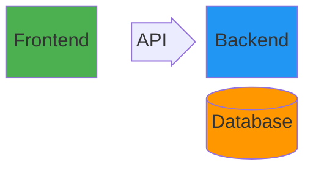
```mermaid
block-beta
    columns 3
    Frontend blockArrowId<["API"]>(right) Backend
    space:2 DB[("Database")]
    
    style Frontend fill:#4CAF50,color:#fff
    style Backend fill:#2196F3,color:#fff
    style DB fill:#FF9800,color:#fff
```

## 18. Packet Diagram

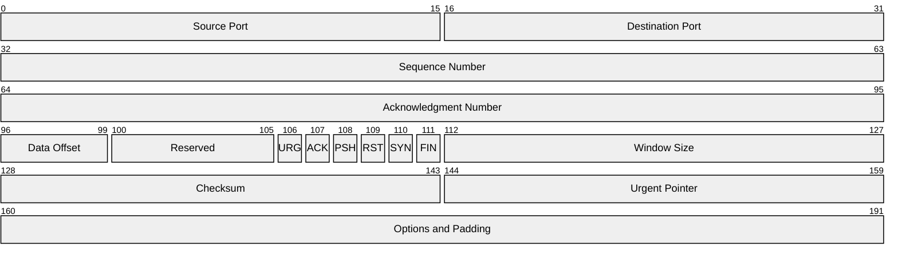
```mermaid
packet-beta
    0-15: "Source Port"
    16-31: "Destination Port"
    32-63: "Sequence Number"
    64-95: "Acknowledgment Number"
    96-99: "Data Offset"
    100-105: "Reserved"
    106: "URG"
    107: "ACK"
    108: "PSH"
    109: "RST"
    110: "SYN"
    111: "FIN"
    112-127: "Window Size"
    128-143: "Checksum"
    144-159: "Urgent Pointer"
    160-191: "Options and Padding"
```

## 19. Kanban Board

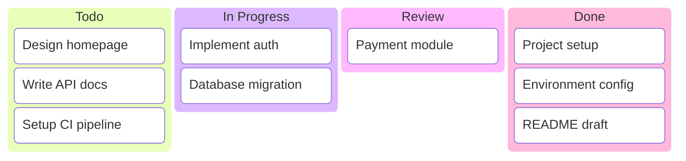
```mermaid
kanban
    Todo
        Design homepage
        Write API docs
        Setup CI pipeline
    In Progress
        Implement auth
        Database migration
    Review
        Payment module
    Done
        Project setup
        Environment config
        README draft
```

## 20. Architecture Diagram

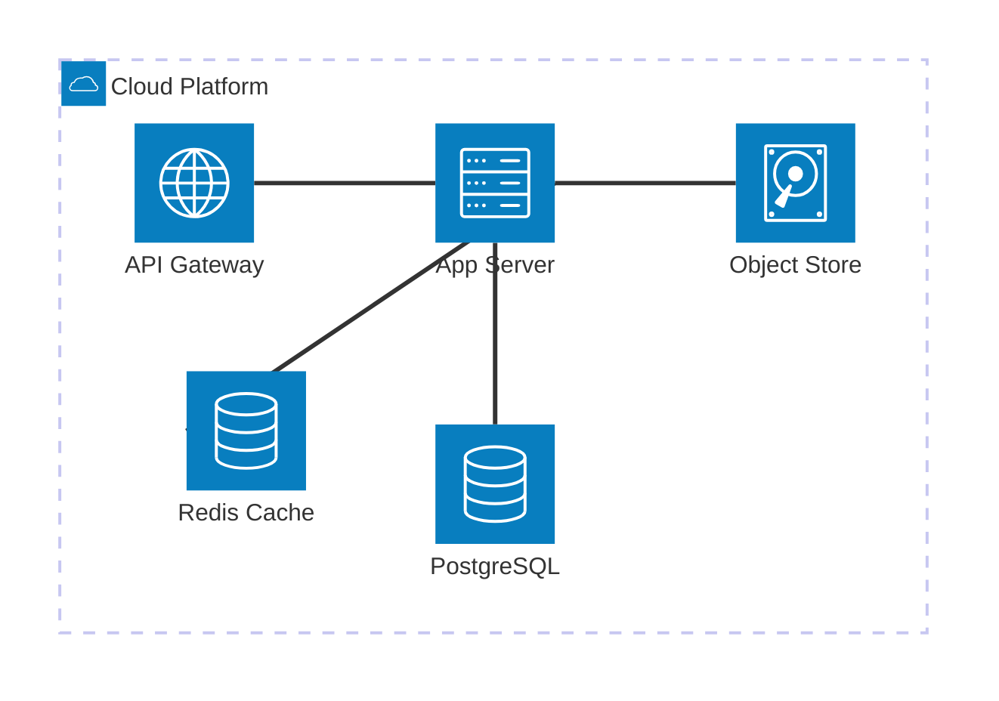
```mermaid
architecture-beta
    group cloud(cloud)[Cloud Platform]

    service gateway(internet)[API Gateway] in cloud
    service app(server)[App Server] in cloud
    service cache(database)[Redis Cache] in cloud
    service db(database)[PostgreSQL] in cloud
    service storage(disk)[Object Store] in cloud

    gateway:R -- L:app
    app:R -- L:cache
    app:B -- T:db
    app:R -- L:storage
```

## 21. Large Complex Flowchart (stress test)

```mermaid
graph TD
    Start([System Boot]) --> Init[Initialize Services]
    Init --> CheckConfig{Config Valid?}
    CheckConfig -->|No| LoadDefaults[Load Defaults]
    CheckConfig -->|Yes| ParseConfig[Parse Config]
    LoadDefaults --> ParseConfig
    ParseConfig --> ConnDB[Connect Database]
    ConnDB --> DBCheck{DB Available?}
    DBCheck -->|No| Retry{Retries < 3?}
    Retry -->|Yes| Wait[Wait 5s] --> ConnDB
    Retry -->|No| Fatal([Fatal: No DB])
    DBCheck -->|Yes| Migrate[Run Migrations]
    Migrate --> MigOK{Migrations OK?}
    MigOK -->|No| Rollback[Rollback] --> Fatal
    MigOK -->|Yes| Cache[Init Cache Layer]
    Cache --> Queue[Init Message Queue]
    Queue --> Auth[Init Auth Module]
    Auth --> API[Start API Server]
    API --> Health[Health Check]
    Health --> HealthOK{Healthy?}
    HealthOK -->|No| Restart[Restart Services] --> Init
    HealthOK -->|Yes| Register[Register with LB]
    Register --> Ready([System Ready])

    style Start fill:#4CAF50,color:#fff
    style Ready fill:#2196F3,color:#fff
    style Fatal fill:#f44336,color:#fff
```

---

> **Total: 21 diagram types.** If any diagram fails to render, the plugin displays the error inline. Click any diagram to open the lightbox and test zoom, pan, and navigation.
